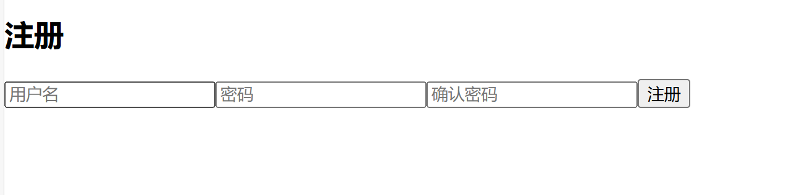

# NkuIR-WebSearch

<center>信息检索系统原理 大作业</center> 
<center>2213919 张祯颉</center>

***

## 目录

***

- [NkuIR-WebSearch](#nkuir-websearch)
  - [目录](#目录)
  - [概述](#概述)
  - [网页抓取](#网页抓取)
    - [南开新闻网](#南开新闻网)
    - [南开大学报](#南开大学报)
    - [南开大学办公室](#南开大学办公室)
    - [澎湃新闻](#澎湃新闻)
  - [文本索引与链接分析](#文本索引与链接分析)
  - [执行查询](#执行查询)
    - [gen\_query](#gen_query)
    - [精确查询](#精确查询)
    - [模糊查询](#模糊查询)
    - [正则表达式查询](#正则表达式查询)
    - [限定域名](#限定域名)
    - [检索部分总结](#检索部分总结)
  - [用户系统](#用户系统)
  - [个性化](#个性化)
    - [个性化搜索](#个性化搜索)
    - [个性化推荐](#个性化推荐)
      - [站内推荐](#站内推荐)
      - [联网推荐](#联网推荐)
  - [前端](#前端)
    - [登陆](#登陆)
    - [注册](#注册)
    - [搜索页](#搜索页)
      - [搜索框](#搜索框)
      - [历史记录](#历史记录)
      - [搜索正文及快照](#搜索正文及快照)
      - [推荐页](#推荐页)
    - [前端布局](#前端布局)
  - [项目结构](#项目结构)
  - [使用方法](#使用方法)
  - [附录：使用例](#附录使用例)
    - [个性化](#个性化-1)
    - [搜索正确性](#搜索正确性)
    - [其他情况](#其他情况)

***
## 概述
本作业是一个简易的Web搜索引擎的实现，主要包括了网页抓取、文本索引与链接分析、执行查询、用户系统、个性化和前端的构造各个步骤。其中，主要使用了下列语言和框架：
- 前端：主要基于react框架
- 后端：python和elasticsearch
- 前后端通讯：基于Flask

代码仓库：[Github链接](https://github.com/Kyotsuki-Tankou/nkuIR-WebSearch)

完整版内容（包含网页条目和未压缩版本的视频）：[链接](https://5p6r2k-my.sharepoint.com/:f:/g/personal/kyotsuki_tankou_5p6r2k_onmicrosoft_com/EtM5csZMJlNNth_zdWH_hAQBUXy3d6O6aIFydfsx01_YQw?e=HB6j1w)

***

## 网页抓取
本实验主要包含了四部分共122331个不同的网页和文件。
### 南开新闻网
本实验抓取了[南开新闻网](https://news.nankai.edu.cn/ywsd/index.shtml)中主要包含了“媒体南开”和“南开要闻”两个板块从2003年到2024年间的新闻，其中“媒体新闻”板块共有25742个不重复页面，“南开要闻”共有15475个不重复的页面，以html网页为主。

抓取部分的核心代码如下，通过`request`库来获取网页的信息，使用`BeautifulSoup`库进行html文件的解析，南开大学报的网页，除第一页以外，目录页是连续且有规律的，而具体的新闻页并不能简单的通过递增来获取。因此，可以在`crawlIndex`函数中提取出这一目录页指向的所有新闻，并进行存储，同时更新映射表。为了防止标题中的特殊字符`/`影响到后续的文件路径的问题，因此将其更换为`^`符号，防止出现这类问题。在`do_page`函数中，通过`BeautifulSoup`进行标题和文本的解析，进行存储和网页快照，并写入url和title的映射表，以便后续检索使用。
```python
def crawlIndex(urls):# 核心代码，省略了部分代码
    for url in urls:
        cnt+=1
        print(f"{cnt} : Processing Page: {url}")
        response=requests.get(url)
        if(response.status_code==200):
            soup=BeautifulSoup(response.content,'html.parser')
            links=soup.find_all('a',href=True,target="_blank")
            for link in links:
                href=link['href']
                text=link.get_text().replace('/','^')
                res_dict[href]=text
                href_urls.append(href)
    return href_urls

def procPage(url): # 核心代码，省略了部分代码
    if url.startswith('http') or url.startswith('https'):
        response = requests.get(url)
        soup=BeautifulSoup(response.content,'html.parser')
        if soup.title:
            title_text=soup.title.string.replace('/','^')
            if len(title_text)>0:
                filepath=f'pages/{title_text}.html'
                with open(filepath,'w',encoding='utf-8') as f:
                    f.write(str(soup.prettify()))
                title2url_df.loc[title_text]=url     
```
### 南开大学报
本实验爬抓取了[南开大学报](https://weekly.nankai.edu.cn)中从2003年至2024年间的新闻的网页，共14353个不重复页面，以html网页为主。南开大学报中，所有的网页均连续，因此可以直接抓取并更新映射表，与上文的`procPage`类似，在此不多赘述。
### 南开大学办公室
本实验抓取了[南开大学办公室](https://xb.nankai.edu.cn)中的“南办发”板块的所有网页，这些网页都会先重定向至一个新的html网页，然后重定向至pdf文件，在这里我们保存的是第一次重定向之前的网页url及最终的pdf文件内容，共计903个文件。

由于出现了复杂的重定向工作，并且涉及下载pdf，因此不能简单的像前面一样使用`request`和`BeautifulSoup`进行抓取。因此，在这里采用了`selenium`库模拟打开一个浏览器（在这里是`Firefox`浏览器）来获取重定向后指向的最终网页。

```python
firefox_options=FirefoxOptions()
firefox_options.add_argument('--headless') # 无头模式，即不真正启动浏览器
geckodriver_path='./geckodriver'
service=FirefoxService(executable_path=geckodriver_path)
driver=webdriver.Firefox(service=service,options=firefox_options)
soup=BeautifulSoup(response.content,'html.parser')
links=soup.find_all('a',href=True,target="_blank")
driver.get(href) # 打开对应网页
time.sleep(5) # 等待重定向
cur_url=driver.current_url # 获取重定向完毕后的网页
```

而在文件下载中，在尝试了多种方式后，最终使用`wget`库对于最终重定向的网页进行下载，由于最终重定向的网页指向一个pdf文件的网站，因此可以直接对其进行下载。
```python
wget.download(cur_url,'./pages/'+text+'.pdf')
```

通过上述方法，就可以抓取南开大学办公室中的所有文件。
### 澎湃新闻
由于南开大学站内的网页的连片数量并不足够10万，因此在征得助教老师同意后，按照爬虫规范抓取了[澎湃新闻](https://www.thepaper.cn)中的近期新闻，共计73590个网页，以html网页为主。同样的，澎湃新闻的网页也是连续的，可以直接抓取并更新映射表。在此不再赘述。

## 文本索引与链接分析
本实验采用了`elasticsearch`搜索框架，版本为8.16.0，并使用了`ik analyzer`进行分词。其中，`ik`分词器包含了`max`和`smart`两种分词方法，其中，`max`方法是保留所有的分词结果，例如`南开大学`可能同时有`南`，`南开`，`大学`等词，而`smart`方法则没有重复部分。在这里的任务中，由于存在短语查询这一任务，因此本实验使用了`max`分词器。

本实验构造了包含下面索引域的索引，即标题、url、锚文本、内容和pagerank值：
```json
"analyzer": {
                "ik_analyzer": {
                    "type": "custom",
                    "tokenizer": "ik_max_word",
                    "filter": ["lowercase"]
                }
            }

"title": {"type": "text", "analyzer": "ik_analyzer"},
"url": {"type": "keyword"},
"anchor_text": {"type": "text", "analyzer": "ik_analyzer"},
"content": {"type": "text", "analyzer": "ik_analyzer"},
"pagerank": {"type": "float"}
```

其中，`pagerank`值通过`BeautifulSoup`获取其中的所有链接，并通过`nx.Digraph`库建立图，并使用`nx.pagerank`计算pagerank值，为了防止pagerank值过分影响计算的结果，通过线性放缩的方式将pagerank值限定在[1,2]区间内。核心代码如下：
```python
soup=BeautifulSoup(file,'html.parser')
links=[a.get('href') for a in soup.find_all('a') if a.get('href')]
graph.add_node(url) # 加点
for link in links: # 加边
    if link in title2url.values():
        graph.add_edge(url,link)

pagerank=nx.pagerank(graph) # 计算pagerank值
min_pr=min(pagerank.values()) 
max_pr=max(pagerank.values())
mapped_pagerank={url:1+(pr-min_pr)/(max_pr-min_pr) for url,pr in pagerank.items()} # 线性映射
```

最后，通过`helpers.bulk`函数将构建好的内容输入es中，由es根据analyzer构建索引。
## 执行查询
本实验主要实现了供站内查询、文档查询、短语查询、通配查询等任务，在本实验中，主要将其归类为：
- 精确查询：即需要精确包含所有关键词才属于检索成功
- 模糊查询：即搜索结果只要包含任意部分即可算检索成功
- 正则表达式查询：通过正则表达式来进行查询
- 限定域名：限定结果的域名

es内部采用了TF-IDF和向量空间模型来进行搜索。本实验将这些查询封装成了conduct_query函数，其中，构造搜索词被进一步封装成gen_query函数。
### gen_query
基础的gen_query的顶层包含两个部分，即合取条件`must_clauses`和析取条件`should_clauses`，并包含了`pagerank`的功能性加分，而最后的highlight部分是为了展示哪些token被匹配上，以便于后续的历史记录和推荐等功能的进行。
```python
query = {
        "query": {
            "function_score": {  # 进行 function_score 查询
                "query": {  # 查询主体
                    "bool": {
                        "must": must_clauses,
                        "should": should_clauses
                    }
                },
                "functions": [
                    {
                        "field_value_factor": {
                            "field": "pagerank",
                            "factor": 1.0,
                            "modifier": "none",
                            "missing": 1.0
                        }
                    }]
            }
        },
        "highlight":{
            "fields":{
                field:{} for field in fields
            }
        }
    }
```
### 精确查询
精确查询可以调用es中的`match_phrase`方法来实现精准匹配。其中，任意一个索引域`field`中包含查询词就可以视为查询成功，因此最内层使用`should`析取方法，且设置最小的匹配个数为1，而由于需要所有关键词，因此外层需要`must`合取方法。具体的构建过程为：
```python
must_clauses = []
for query_word in query_word_term:
    must_clauses.append(
        {
            "bool": {
                "should": [
                    {"match_phrase": {field: query_word}} for field in fields
                ],
                "minimum_should_match": 1
            }
        }
    )
```
### 模糊查询
模糊查询则使用`match`方法即可，其他部分和精准匹配没有太多区别。

### 正则表达式查询
虽然`es`框架提供了正则表达式查询，然而在中文环境下，其正则表达式查询的粒度是到索引，即对分词后的词进行正则，一般来说，这些词的长度都很短，没有进行正则的价值，这并不是用户真正需要的，用户一般需要的是在正文中进行正则表达式的筛选，因此，在这里使用的方式是：先将正则表达式的词加入模糊搜索词中进行初筛，再使用python的`re`库来进行正则表达式的筛选，找到符合的文本。
```python
#正则加入模糊词：query_word_phrase=query_word_phrase+query_word_regex
query=gen_query(query_word_term=query_word_term,query_word_phrase=query_word_phrase+query_word_regex,
                    fields=fields,frequent_token=frequent_token)
regex_patterns=[re.compile(regex_word) for regex_word in query_word_regex]
if len(regex_patterns)>0:
    match_found=any(pattern.search(title) or pattern.search(url) or pattern.search(text_content) for pattern in regex_patterns)
    if not match_found:
        continue
```
### 限定域名
为了实现站内查询，可以通过扫描url进行限定域名的查询，当搜索结果的url中没有想要的时，舍弃这一结果。
```python
if (query_domain is not None) and (query_domain not in url):
    continue
```
### 检索部分总结
在完成了这些功能后，重新审视上述的要求：
- 站内查询：通过限定域名的方式即可进行站内查询
- 短语查询：精准查询，通过^可以给出不同的查询词，且他们需要同时满足。例如，`南开大学`只能搜索出连续的`南开大学`词汇，而`南开^大学`则可以搜索到`南开是一门综合性大学`这种不连续的文本，从而实现了短语查询。
- 通配查询：即正则表达式查询
- 文档查询：若将content和title域均设置为标题，则文档查询退化为网页查询，也可也通过精准查询或模糊查询等查询方式进行检索
## 用户系统
为了实现后续的搜索历史和个性化等功能，还需要一个简易的用户系统。在这里，用户的数据文件使用`json`文件存储在`userdata`文件夹中，每个用户数据文件的格式如下，包含了用户的账号密码，搜索历史和常用词等功能：
```json
{
    "account": "USERNAME",
    "password": "PASSWORD",
    "history": [],
    "freq_word": []
}
```

此外，也提供了一些用于操作用户数据的函数，例如注册、登陆和读取用户数据等。这些函数都较为简单，在这里不再赘述。在具体的查询函数中，用户历史部分存储了最近10次的查询记录，以及10个常用词。常用词的具体构造方法见个性化部分。

## 个性化
个性化主要包括了两个部分，一个是按照用户的历史搜索更改结果项的排列顺序，另一个则是进行搜索的推荐。
### 个性化搜索
在每次搜索时，通过正则表达式扫描被`highlight`标注的命中token（也就是`<em> token </em>`），记录命中次数最多的数个token
```python
token_counter=Counter()
highlight_pattern=re.compile(r'<em>(.*?)</em>')#统计各个token的出现次数
highlights=hit.get('highlight',{})
for field,highlight in highlights.items():
    for fragment in highlight:
        tokens=highlight_pattern.findall(fragment)
        token_counter.update(tokens)
for token,count in token_counter.most_common():
    if token in query_list.keys():
        query_list[token]+=count
    else:
        query_list[token]=count
```

检索完毕后对最多的5个token加入freq_word中，如果已经存在，则删除过往记录，新建一个新的记录插在最后，实现类似LRU的记录更新。
```python
sorted_querylist=sorted(query_list,key=lambda k:query_list[k],reverse=True)
freq_cnt=0
for freq in sorted_querylist:
    freq_cnt+=1
    if freq_cnt>5:
        break
    if freq in userdata['freq_word']:
        userdata['freq_word']=[item for item in userdata['freq_word'] if item!=freq]
    userdata['freq_word'].append(freq)
    if len(userdata['freq_word'])>=10:
        userdata['freq_word'].pop(0)
```

然后在query_gen中添加对于常用词的额外加分，先编制常用词词表，`frequent_token_clauses`，并插入模糊搜索词中，以便于常用词可以被匹配到。
```python
frequent_token_clauses = []
for token in frequent_token:
    frequent_token_clauses.append(
        {
            "bool": {
                "should": [
                    {"match": {"content": token}},
                    {"match": {"title": token}}
                ],
                "minimum_should_match": 1
            }
        }
    )
```

加分逻辑中，对于索引域content和title进行匹配，如果出现了match，也就是成功匹配，则对其进行加分，每个+2.0分，最多累积10个加分。
```python
"functions":[
{
    "weight": 2.0,  # 针对 frequent_token 的加分
    "filter": {
        "bool": {
            "should": [
                {"match": {"content": token}} for token in frequent_token
            ] + [
                {"match": {"title": token}} for token in frequent_token
            ]
        }
    }
}],
"boost_mode": "sum",
"max_boost": 20.0
```

通过这一方式，可以成功的改变搜索条目的排序，实现针对用户的个性化搜索。
### 个性化推荐
这里实现了两种个性化推荐，包括站内推荐和联网推荐，其中站内推荐属于搜索上的联想关联和基于用户的使用习惯的个性化推荐，而联网推荐则既包括了搜索上的联想关联，也包括了内容分析的推荐。
#### 站内推荐
站内推荐的思路是，通过将原来的精确搜索词变为模糊搜索，这样虽然会降低内容的相关性，但是能够扩大搜索的范围，从而实现相关推荐，此外，为了防止推荐到自己，因此可以将上一次的搜索结果输入，由于url的唯一性，便可以区分是否在搜索正文中出现，并由此实现站内推荐。

此外，若将常用词也加入推荐过程，就可以实现基于用户的个性化推荐。
```python
# 修改搜索词
query_word_term=[],
query_word_phrase=query_word_phrase+query_word_term+query_word_regex
query_word_regex=[],
# 去重
if url in used_list:
    continue
```

#### 联网推荐
联网推荐则相当简单，通过调用百度搜索的api，从百度中获取相关内容，实现推荐。
```python
from baidusearch.baidusearch import search
baidu_word=(query_term+' '+query_phrase+' '+query_regex).replace('^',' ')
rec2_result=search(baidu_word,num_results=10)
```
## 前端
在这里使用react框架构建前端。主要包含了登陆页、注册页和搜索首页三个页面，其中，登陆页为首页，此外，前后端的通信还包括了网页快照等功能。

具体的前端页面见附录。
### 登陆
登陆页包含两个输入框，即用户名和密码，此外还有两个按钮，即登陆和注册。当按下登陆后，会将输入的用户名和密码发送给后端进行判断，并根据返回值决定是否跳转到搜索页。

其中，前后端的通信方式如下，在前端，通过与位于对应端口的api`login`进行通信和参数的打包和发送，获取后端的响应，当响应的success位是True时，跳转搜索主页，而否则根据错误码输出错误信息。
```js
// frontend
const handleLogin = async () => {
    try {
      const response = await fetch('http://127.0.0.1:5000/login', {
        method: 'POST',
        headers: {
          'Content-Type': 'application/json',
        },
        body: JSON.stringify({ account, password }),
      });
      const data = await response.json();
      if (data.success) {
        navigate('/search');
      } else {
        alert('登录失败: ' + data.message);
      }
    } catch (error) {
      console.error('Error:', error);
    }
};
  
const handleSignup=()=>{
navigate('/signup')
}
```

在后端，首先需要处理`OPTIONS`响应的情况，并在响应头中设置`CORS`相关的字段，以允许跨域请求。具体允许的方法是`POST`，允许的请求头是`Content-Type`，并且允许所有来源访问，以便于后续的`POST`响应。然后解析数据，并发送给`log_in`函数，根据各个内容决定返回的数据和错误码。
```python
#backend
@app.route('/login', methods=['POST','OPTIONS'])
def login():
    global have_login
    global userdata
    if request.method=='OPTIONS':
        response=app.make_default_options_response()
        response.headers['Access-Control-Allow-Methods']='POST'
        response.headers['Access-Control-Allow-Headers']='Content-Type'
        response.headers['Access-Control-Allow-Origin']='*'# 允许所有来源
        return response
        
    data = request.get_json()
    account = data.get('account')
    password = data.get('password')
    if not account or not password:
        return jsonify({"success": False, "message": "账号和密码不能为空"}), 400

    status,userdata=log_in(account, password)
    if status:
        have_login=True
        return jsonify({"success": True, "message": "登录成功", "userdata": userdata}), 200
    else:
        return jsonify({"success": False, "message": "账号或密码错误"}), 401

```
### 注册
注册和登陆的前后端流程基本类似，包含了用户名、密码和确认密码三个部分，具体代码在此不再赘述，后端的对应api为`singup`。
### 搜索页
搜索页由四个部分构成，即搜索框、历史记录、搜索正文和相关推荐。下面分别介绍这几个部分。
#### 搜索框
搜索框包含了前述的四个搜索部件，即精确搜索、模糊搜索、正则表达式搜索和返回条目数量。这几个部分的前端代码较为简单，在此不叙。此外，搜索框下方还包含了搜索按键，当按下搜索按键后，前端将各数据打包并发送给后端，等待后端的数据返回，相关过程类似于登陆界面，在此不再赘述。在这里主要关注后端的处理过程。

后端需要先检查状态是否异常，解压数据，并检查是否存在指定的搜索条目字段等，然后连续调用两次`conduct_query`函数执行主体搜索和推荐，随后还需要更新常用词表和历史记录，并重新写入json文件。此外，还需要调用百度的api进行搜索，来计算最终的联网推荐。最后，将这些内容打包成json发送回前端，由前端的搜索正文进行解析。

#### 历史记录
在网页加载和按下搜索键后，需要前端向后端通信以获取新的用户数据，从而解析历史记录。因此可以将获取用户信息抽象出一个后端api，以供前端读取，在读取后，通过解压各项历史，将其放在表格中，展示近期的搜索记录。具体来说，使用`useEffect`钩子和在`search`的按钮事件后，更新`userData`的值并绘制历史记录的表格。

#### 搜索正文及快照
在按下搜索键后，需要处理返回的搜索结果数据，可以通过检测是否有`result`来决定是否渲染，每个搜索结果包括标题（带有url的超链接）、快照（带有前往静态数据区快照的链接）和正文内容。具体的前端代码如下，较为简单不做解释：
```js
{results.res_list.length === 0 ? (
    <p>未检索出对应内容</p>
) : (
    results.res_list.map((item, index) => {
    const snapshotPath = item.content.endsWith('.pdf')
    ? `http://127.0.0.1:5000/static/snapshot/pdfs/${item.title}.pdf`
    : `http://127.0.0.1:5000/static/snapshot/html/${item.title}.html`;
    console.log(snapshotPath)
    return(
    <div key={index}>
        <a href={item.url} target="_blank" rel="noopener noreferrer">
        {item.title}
        </a>
        {}
        <a href={snapshotPath} target="_blank" rel="noopener noreferrer" style={{marginLeft:'10px'}}>快照</a>
        <p>{item.content}</p>
    </div>);
    })
)}
```

其中需要注意的是快照部分，快照存储于于后端代码`main`函数目录下的`static`数据区中，这里是`Flask`对应的默认静态数据区，也就是说，直接访问对应api的`static`数据区的对应路径即可访问对应的页面。此外，也可以人为指定修改静态数据区的路径来进行访问。

#### 推荐页
通过解析后端发来的两个推荐信息，即可绘制两个推荐的结果。这部分和搜索主体的区别不大，在此不再赘述。

### 前端布局
此外，也进行了简单的一些前端的布局，使得界面更加美观。

## 项目结构
项目的代码部分主要包含了四个个文件夹，即`utils`, `frontend`, `backend`, `worm`，其中各文件的作用可参考下面的树状图。
```bash
nkuIR-WebSearch
├─backend #后端
│      account.py # 处理账号相关
│      do_search.py # 执行搜索
│      main.py # 后端接口
│      query_gen.py # 生成查询词
│
├─frontend # 前端
├─utils # 工具代码
│     console-search.py # 调试用的控制台搜索
│     data_bulk.py # 存入html
│     es-utils.py # 部分es调试工具
│     gen_new_indice.py # 为es创建索引
│     pdf_bulk.py # 存入pdf
│
└─worm #爬虫
        worm-nkdxb.py # 南开大学报
        worm-nkdxbgs.py # 南开大学办公室
        worm-nkxw.py # 南开新闻
        worm-ppxw.py # 澎湃新闻
```

此外，还需要使用ik分词器和elasticsearch才能正常使用。
## 使用方法
在windows系统下，可以使用根目录下的setup.bat脚本来进行启动。若是其它系统或需要手动启动，则需要
- 在根目录下启动`backend/main.py`
- 在frontend目录下的控制台输入`npm start`
- 启动安装了正确ik分词器的·elasticsearch·客户端

在进入的界面，进行注册或登陆，即可进入搜索界面，搜索界面不同的关键词或短语使用`^`隔开。
## 附录：使用例
### 个性化
下面列出了不同情况下的搜索，以展现个性化搜索和个性化推荐的正常运行
* 刚刚注册的账号，输入`程明明`的搜索结果：
* 紧接着，输入`华为`的搜索结果：可以验证，前两条消息均为程明明老师的相关报道
* 再次搜索`程明明`的搜索结果：可以发现，此时前两条信息都变成了程明明老师与华为的相关信息，与第一次检索的结果不同，可以证明，个性化搜索可以正常运行。此外，站内外的推荐也对程明明、华为、明明等搜索关键词进行了联想和推荐。

### 搜索正确性
下面列出了一些搜索的运行情况，以表明这些搜索的运行情况是正确的
其中，单短语精确搜索的结果可以见上一节
* 多短语精确搜索【搜索词：`程明明^CT影像`】
* 模糊搜索【搜索词：`人工智能技术`】说明：可以见到，搜索词`人工智能技术`是一个较为拗口的表达，只有前几条是完全匹配上的，而后续的搜索结果基本仅有'人工智能'，而没有'技术'一词的出现
* 正则表达式搜索【搜索词：`程明+^A+I`】说明：这些结果均为程明明老师的相关新闻，且均有`AI`或`AAAI`以匹配正则表达式。
* 限定域名
  * 未限定域名【搜索词：`人工智能`】说明：可以见到，由于此前搜索的原因，搜索`人工智能`，排在前面的大部分都是程明明老师的报道，且都在南开大学新闻网内的报道。
  * 限定域名【搜索词：`人工智能`，限定域名：`https://www.thepaper.cn	`】说明：限定域名后，可以看到返回的都是澎湃新闻的相关报道
* 文件搜索【搜索词：`南办发`】
* 网页快照（可由顶端的域名知道是快照内容）
  * pdf文件
  * html网页
* 混合搜索说明：【搜索词：精确：`CT^AI`；模糊：`南开大学计算机学院`；正则表达式`程明+`；指定域名`nankai`】搜索结果需要位于`nankai`域名内，包含`南开大学计算机学院`的任一token，且要有`CT`和`AI`两个短语，还需要满足搜索结果为`程明···明`（其中`明`字至少一个，不能没有），而返回的项目是符合要求的。

通过上面的样例可以看出，本搜索引擎可以正确的完成各项任务。

### 其他情况
下面列出了一些其他会用到的情况下的页面
* 登陆界面
* 输入空账号或密码
* 输入错误密码或用户不存在
* 注册界面
* 注册界面的部分错误情况
* 未进行搜索时的搜索界面
* 进行搜索后的搜索界面